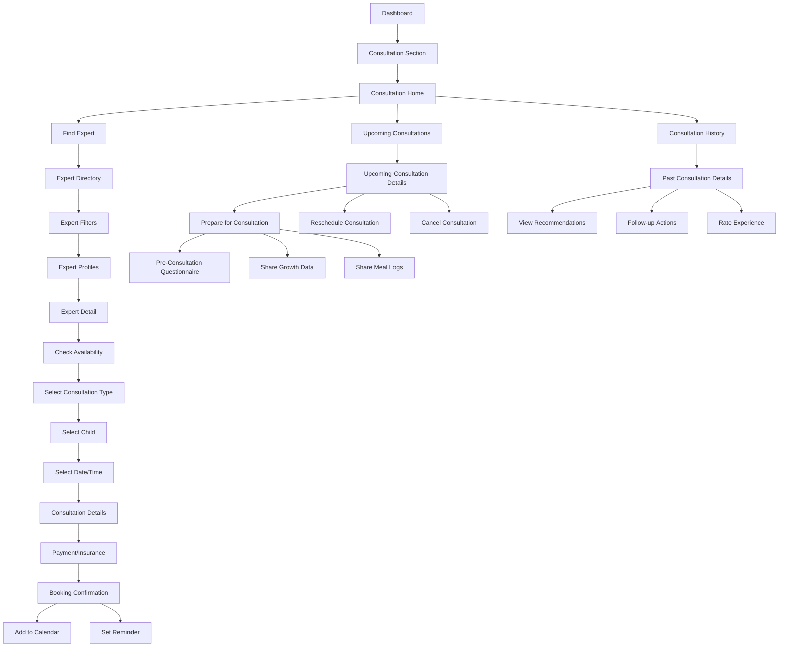

# Expert Consultation User Flow

This document outlines the step-by-step flow for the expert consultation feature of the NutriGenius application.

## Flow Diagram

## Detailed Steps

### 1. Accessing Consultation Feature

**1.1 Dashboard Navigation**
- **Screen Elements**:
  - Dashboard with Consultation section card
  - Upcoming consultation preview (if scheduled)
  - Quick action button to find expert
- **User Actions**: Tap on Consultation section card

**1.2 Consultation Home**
- **Screen Elements**:
  - "Find an Expert" prominent button
  - Upcoming consultations section
  - Consultation history section
  - Quick access to recent expert contacts
  - Consultation benefits information
- **User Actions**: Choose desired consultation action

### 2. Finding and Selecting an Expert

**2.1 Expert Directory**
- **Screen Elements**:
  - Search bar for expert name
  - Filter button
  - Sorting options (rating, availability, etc.)
  - List of experts with:
    - Photo
    - Name and credentials
    - Specialization
    - Rating
    - Availability indicator
- **User Actions**: 
  - Search for specific expert
  - Apply filters
  - Browse expert list

**2.2 Expert Filtering**
- **Screen Elements**:
  - Filter categories:
    - Specialization (pediatric nutrition, stunting, allergies, etc.)
    - Language spoken
    - Availability (date/time)
    - Experience level
    - Rating threshold
    - Insurance accepted
  - Apply and reset buttons
  - Filter chips for active filters
- **User Actions**:
  - Select relevant filters
  - Apply filters
  - Clear filters if needed

**2.3 Expert Profile**
- **Screen Elements**:
  - Professional photo
  - Name and credentials
  - Specialization and experience
  - Bio/about section
  - Education and certifications
  - Languages spoken
  - Rating and reviews
  - Consultation types offered
  - Availability calendar preview
  - "Check Availability" button
- **User Actions**: 
  - Read expert details
  - View reviews
  - Tap "Check Availability" to proceed

### 3. Booking a Consultation

**3.1 Availability Calendar**
- **Screen Elements**:
  - Month/week view calendar
  - Available time slots highlighted
  - Unavailable times grayed out
  - Time zone indicator and selector
  - Date navigation controls
- **User Actions**: 
  - Navigate calendar
  - Select available date
  - Select available time slot

**3.2 Consultation Type Selection**
- **Screen Elements**:
  - Consultation type options:
    - Video consultation
    - Audio consultation
    - Chat consultation
    - In-person (if available)
  - Duration and price for each type
  - Brief description of each option
- **User Actions**: Select preferred consultation type

**3.3 Child Selection**
- **Screen Elements**:
  - List of registered children
  - Option to select multiple children (if applicable)
  - "Add new child" option
- **User Actions**: Select child(ren) for consultation

**3.4 Consultation Details**
- **Screen Elements**:
  - Form for consultation reason/concerns
  - Checkbox options for common concerns:
    - Growth concerns
    - Feeding difficulties
    - Dietary restrictions
    - Nutritional deficiencies
  - Text area for additional information
  - Option to attach relevant documents
- **User Actions**: 
  - Enter consultation details
  - Select relevant concerns
  - Add attachments if needed

**3.5 Payment and Insurance**
- **Screen Elements**:
  - Consultation fee summary
  - Insurance information entry (if applicable)
  - Payment method selection
  - Terms and conditions
  - Privacy policy regarding medical information
- **User Actions**:
  - Enter insurance information
  - Select payment method
  - Accept terms
  - Confirm booking

**3.6 Booking Confirmation**
- **Screen Elements**:
  - Success message
  - Consultation details summary:
    - Expert name
    - Date and time
    - Consultation type
    - Child name(s)
  - Add to calendar button
  - Set reminder options
  - "What to expect" information
- **User Actions**:
  - Add to calendar
  - Set reminders
  - Return to dashboard

### 4. Managing Upcoming Consultations

**4.1 Upcoming Consultation List**
- **Screen Elements**:
  - Chronological list of scheduled consultations
  - For each consultation:
    - Expert photo and name
    - Date and time
    - Consultation type
    - Child name(s)
    - Status indicator
  - "Prepare" button for upcoming consultations
- **User Actions**: 
  - View upcoming consultations
  - Select consultation for details

**4.2 Upcoming Consultation Details**
- **Screen Elements**:
  - Complete consultation information
  - Countdown to consultation
  - Expert details with contact option
  - Preparation checklist
  - Reschedule button
  - Cancel button
  - "Join Consultation" button (active near start time)
- **User Actions**:
  - Review details
  - Prepare for consultation
  - Reschedule or cancel if needed

**4.3 Consultation Preparation**
- **Screen Elements**:
  - Pre-consultation questionnaire
  - Option to share growth data
  - Option to share meal logs
  - Reminder to prepare questions
  - Technical check for video/audio consultations
  - Notification settings for consultation reminder
- **User Actions**:
  - Complete questionnaire
  - Share relevant data
  - Perform technical check

**4.4 Reschedule Consultation**
- **Screen Elements**:
  - Current appointment details
  - Rescheduling policy information
  - New availability calendar
  - Confirmation of changes
- **User Actions**:
  - Select new date/time
  - Confirm changes

**4.5 Cancel Consultation**
- **Screen Elements**:
  - Cancellation policy information
  - Reason for cancellation options
  - Refund information (if applicable)
  - Confirmation dialog
- **User Actions**:
  - Select cancellation reason
  - Confirm cancellation

### 5. Consultation Experience

**5.1 Consultation Reminder**
- **Screen Elements**:
  - Push notification
  - In-app alert
  - "Join Now" button
  - Countdown timer
- **User Actions**: Tap to join consultation

**5.2 Consultation Interface**
- **Screen Elements**:
  - Video/audio feed (for video/audio consultations)
  - Chat interface (for all consultation types)
  - Child profile information sidebar
  - Growth data visualization (if shared)
  - Meal log visualization (if shared)
  - Screen sharing option
  - End consultation button
- **User Actions**:
  - Communicate with expert
  - Share additional information as needed
  - End consultation when complete

**5.3 Post-Consultation Summary**
- **Screen Elements**:
  - Consultation duration
  - Key points discussed
  - Expert recommendations
  - Prescribed actions
  - Follow-up appointment suggestion (if applicable)
  - Rate experience prompt
- **User Actions**:
  - Review summary
  - Schedule follow-up if recommended
  - Rate experience

### 6. Consultation History and Follow-up

**6.1 Consultation History**
- **Screen Elements**:
  - Chronological list of past consultations
  - For each consultation:
    - Expert name and photo
    - Date and time
    - Consultation type
    - Child name(s)
    - Status (completed, missed, etc.)
  - Filter and search options
- **User Actions**:
  - Browse history
  - Filter or search past consultations
  - Select consultation for details

**6.2 Past Consultation Details**
- **Screen Elements**:
  - Complete consultation information
  - Expert recommendations
  - Prescribed actions with completion checkboxes
  - Attached resources from expert
  - Notes from consultation
  - Option to book follow-up
  - Rating and feedback section
- **User Actions**:
  - Review recommendations
  - Mark actions as completed
  - Access resources
  - Book follow-up
  - Provide rating and feedback

**6.3 Expert Recommendations**
- **Screen Elements**:
  - List of recommendations
  - Action items with due dates
  - Integration with other app features:
    - Meal planning suggestions
    - Growth monitoring reminders
    - Educational content links
  - Progress tracking for recommendations
- **User Actions**:
  - Review recommendations
  - Navigate to related app features
  - Mark recommendations as implemented

## Special Cases

### Urgent Consultations
- **Implementation**:
  - "Urgent Consultation" option with expedited booking
  - Limited to specific urgent concerns
  - Faster matching with available experts
  - Priority queuing system

### Technical Issues During Consultation
- **Handling**:
  - Troubleshooting guide
  - Alternative communication method options
  - Automatic rescheduling for severe technical failures
  - Partial refund policy for technical failures

### Expert Unavailable/Cancellation
- **Process**:
  - Immediate notification
  - Quick rebooking options
  - Suggested alternative experts
  - Priority booking status

### Follow-up Consultations
- **Features**:
  - Streamlined booking process
  - Previous consultation data automatically shared
  - Progress tracking between consultations
  - Discounted rates for follow-ups

## Success Metrics

- **Booking Completion Rate**: Percentage of started bookings that complete
- **Consultation Attendance Rate**: Percentage of booked consultations attended
- **Reschedule/Cancellation Rate**: Frequency of appointment changes
- **Expert Ratings**: Average ratings given to experts
- **Recommendation Implementation**: Percentage of expert recommendations marked as completed
- **Follow-up Rate**: Percentage of consultations that lead to follow-up bookings
- **User Satisfaction**: Post-consultation satisfaction scores

## Integration Points

- **Growth Monitoring**: Sharing growth data with experts
- **Meal Logging**: Sharing meal logs with experts
- **Calendar**: Adding consultations to device calendar
- **Notifications**: Reminders for upcoming consultations
- **Educational Content**: Expert-recommended articles and resources 