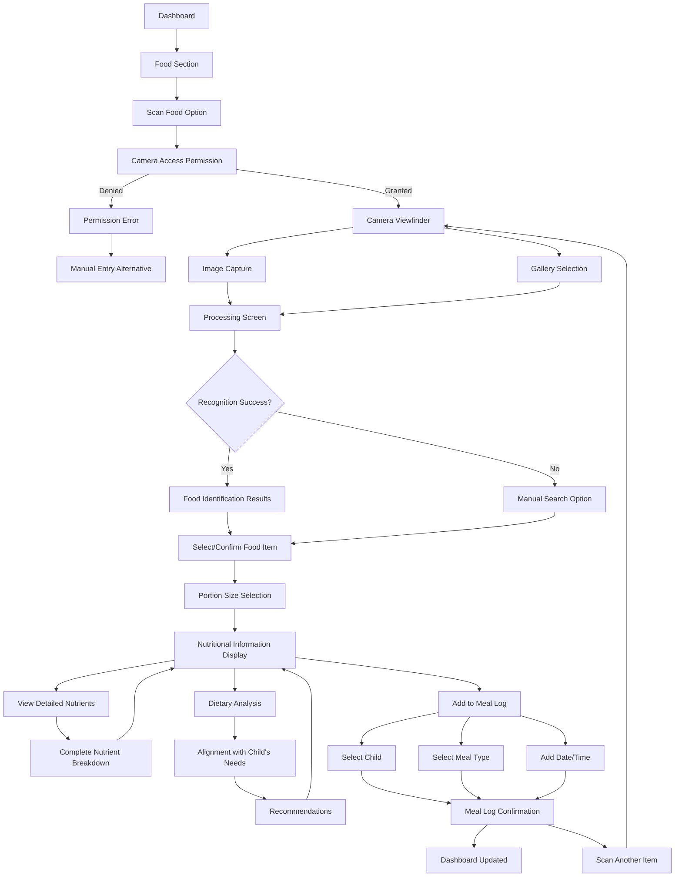

# Food Scanning User Flow

This document outlines the step-by-step flow for the food scanning and nutritional analysis feature of the NutriGenius application.

## Flow Diagram

## Detailed Steps

### 1. Accessing Food Scanning

**1.1 Dashboard Navigation**
- **Screen Elements**:
  - Dashboard with Food/Nutrition section
  - Quick action button for food scanning
  - Recent meal logs summary
- **User Actions**: Tap food section or quick action button

**1.2 Food Section Overview**
- **Screen Elements**:
  - Meal logging options
  - Scanning option prominently displayed
  - Food history
  - Nutritional insights
- **User Actions**: Tap "Scan Food" button

**1.3 Camera Permission**
- **Screen Elements**:
  - Permission request dialog (native OS)
  - Explanation of why camera access is needed
  - Option to proceed or cancel
- **User Actions**: Grant camera permission or deny

**1.3.1 Permission Denied Handling**
- **Screen Elements**:
  - Explanation of limitations without camera access
  - Instructions to enable permission in settings
  - Alternative manual entry option
- **User Actions**: Go to settings, use manual entry, or cancel

### 2. Image Acquisition

**2.1 Camera Viewfinder**
- **Screen Elements**:
  - Live camera feed
  - Framing guide overlay
  - Capture button
  - Flash toggle
  - Gallery access button
  - Tips for good food photos
- **User Actions**: 
  - Position food in frame
  - Tap capture button or select from gallery

**2.2 Image Review**
- **Screen Elements**:
  - Captured image
  - Retake option
  - Proceed option
  - Cropping tool
- **User Actions**: 
  - Accept image
  - Retake if needed
  - Crop if desired

**2.3 Processing Feedback**
- **Screen Elements**:
  - Loading animation
  - Progress indicator
  - Text explaining AI processing
  - Cancel button
- **User Actions**: Wait for processing or cancel

### 3. Food Identification

**3.1 Recognition Results**
- **Screen Elements**:
  - Top matching food items
  - Confidence percentage for each match
  - Image of identified food
  - "Not what I see" option
  - Manual search option
- **User Actions**: 
  - Select correct food item
  - Use manual search if needed

**3.2 Failed Recognition Handling**
- **Screen Elements**:
  - Message indicating recognition challenge
  - Suggestions for improving image
  - Manual search interface
  - Retry with new photo option
- **User Actions**:
  - Enter food name manually
  - Retake photo
  - Select from category browsing

**3.3 Food Selection Confirmation**
- **Screen Elements**:
  - Selected food name and image
  - Basic nutritional preview
  - Proceed button
  - Back to results button
- **User Actions**: Confirm selection or go back

### 4. Portion Size and Details

**4.1 Portion Size Selection**
- **Screen Elements**:
  - Visual portion size options
  - Measurement units (grams, cups, pieces, etc.)
  - Quantity input
  - Common serving sizes
  - Visual reference comparisons
- **User Actions**:
  - Select portion type
  - Adjust quantity
  - Proceed to nutrition details

**4.2 Food Details Adjustment**
- **Screen Elements**:
  - Cooking method options (if applicable)
  - Preparation type (fresh, frozen, canned)
  - Brand selection (if applicable)
  - Additional ingredients toggle
- **User Actions**:
  - Adjust details as needed
  - Add additional ingredients if applicable
  - Proceed to nutritional information

### 5. Nutritional Information

**5.1 Nutrition Summary**
- **Screen Elements**:
  - Key nutrients display:
    - Calories
    - Protein
    - Carbohydrates
    - Fat
    - Fiber
    - Key vitamins and minerals
  - Visual representation of nutritional balance
  - Child's daily needs comparison
  - "View all nutrients" option
- **User Actions**:
  - Review information
  - Tap to view detailed breakdown
  - Proceed to add to meal log

**5.2 Detailed Nutrient View**
- **Screen Elements**:
  - Complete nutrient breakdown
  - Percentage of daily value for each nutrient
  - Color coding for nutrients (high/good/concerning)
  - Expandable categories (vitamins, minerals, etc.)
- **User Actions**:
  - Scroll through complete list
  - Expand categories
  - Return to summary view

**5.3 Dietary Analysis**
- **Screen Elements**:
  - Alignment with child's nutritional needs
  - Growth support assessment
  - Allergen alerts if applicable
  - Recommendations for pairing foods
  - Nutritional benefits highlight
- **User Actions**:
  - Review analysis
  - Tap on recommendations for details
  - Return to summary view

### 6. Meal Logging

**6.1 Log Configuration**
- **Screen Elements**:
  - Child selection (if multiple profiles)
  - Meal type selection (breakfast, lunch, dinner, snack)
  - Date and time selector (defaults to current)
  - Add notes option
- **User Actions**:
  - Select child, meal type, date/time
  - Add optional notes
  - Tap "Add to Meal Log"

**6.2 Confirmation & Options**
- **Screen Elements**:
  - Success confirmation message
  - Updated daily nutrition summary
  - Options:
    - View meal log
    - Scan another item
    - Return to dashboard
  - Recipe suggestions based on scanned item
- **User Actions**:
  - Select next action

**6.3 Multi-Item Meal Logging**
- **Screen Elements**:
  - Current meal items list
  - Combined nutritional information
  - "Add Another Item" option
  - "Complete Meal" button
- **User Actions**:
  - Add more items to same meal
  - Complete the meal logging

### 7. Dashboard Updates

**7.1 Updated Dashboard View**
- **Screen Elements**:
  - Recently logged meal
  - Updated nutritional progress for the day
  - Recommendations based on logged foods
  - Prompt for next meal if applicable
- **User Actions**: Continue with app usage

## Special Cases

### Unrecognized Foods
- Fallback to manual search
- Option to submit the image for database improvement
- Guided manual entry with categories and filters

### Packaged Foods with Barcodes
- Option to scan barcode instead of food image
- Retrieval of product information from barcode database
- Manual adjustment option if barcode information is incorrect

### Homemade/Mixed Dishes
- "Mixed dish" option in identification results
- Component selection interface
- Recipe builder functionality
- Option to save custom recipes for future use

### Special Dietary Restrictions
- Allergen alerts if child has registered allergies
- Warnings for foods contradicting dietary restrictions
- Alternative suggestions when applicable

### Low Connectivity Situations
- Offline mode with limited database
- Queue for processing when connectivity returns
- Simplified manual entry option

## Success Metrics

- **Recognition Accuracy**: Percentage of correctly identified foods
- **Manual Entry Fallbacks**: Rate of using manual entry after failed recognition
- **Completion Rate**: Percentage of started scans that complete with meal logging
- **Scan-to-Log Time**: Average time from scan initiation to completed log
- **Feature Retention**: Return rate to scanning feature

## Integration Points

- **Meal Logging**: Direct integration with meal history and nutritional tracking
- **Nutritional Recommendations**: Suggestions based on scanned food and nutritional gaps
- **Educational Content**: Contextual links to nutritional information about scanned foods
- **Growth Monitoring**: Connection between logged nutrition and growth status

## Future Enhancements

1. **Multiple Item Detection**: Ability to identify multiple food items in a single image
2. **Portion Estimation from Image**: AI-based estimation of portion size from visual data
3. **Recipe Suggestion**: Recommend recipes based on scanned ingredients
4. **Meal Pattern Analysis**: Identify eating patterns and suggest improvements
5. **Restaurant Menu Scanning**: Recognition of menu items from popular restaurants 