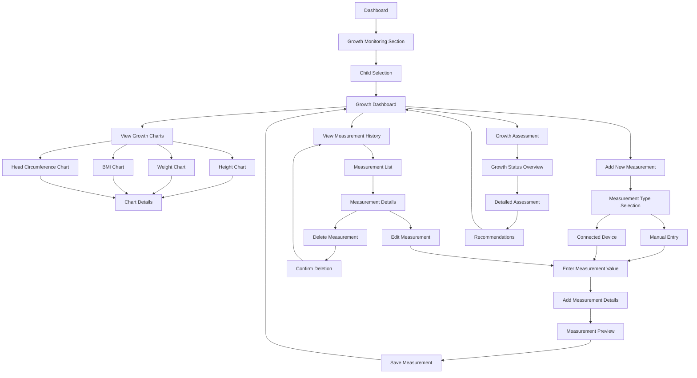

# Growth Monitoring User Flow

This document outlines the step-by-step flow for the growth monitoring feature of the NutriGenius application.

## Flow Diagram

## Detailed Steps

### 1. Accessing Growth Monitoring

**1.1 Dashboard Navigation**
- **Screen Elements**:
  - Dashboard with growth monitoring card/section
  - Growth status summary
  - Last measurement date
  - Quick action button to add new measurement
- **User Actions**: Tap on growth monitoring card/section

**1.2 Child Selection (for multiple children)**
- **Screen Elements**:
  - List of children profiles
  - Child name, age, and photo
  - Last measurement date for each child
- **User Actions**: Select child to view growth data

**1.3 Growth Dashboard**
- **Screen Elements**:
  - Child name and age
  - Current growth metrics (height, weight, BMI, head circumference)
  - Growth percentile indicators
  - WHO growth standard reference
  - Growth status indicators (normal, stunted, wasted, overweight)
  - Last measurement date
  - Action buttons (view charts, add measurement, view history, assessment)
- **User Actions**: Choose desired action from available options

### 2. Viewing Growth Charts

**2.1 Chart Type Selection**
- **Screen Elements**:
  - Tabs for different chart types:
    - Height-for-age
    - Weight-for-age
    - BMI-for-age
    - Head circumference-for-age (for children under 3)
  - Current chart highlighted
- **User Actions**: Tap desired chart tab

**2.2 Chart Visualization**
- **Screen Elements**:
  - Line chart with:
    - X-axis: Age (months/years)
    - Y-axis: Measurement value
    - Plotted child data points
    - WHO standard reference lines (3rd, 15th, 50th, 85th, 97th percentiles)
    - Color coding for percentile zones
  - Legend explaining lines and zones
  - Time period selector (3 months, 6 months, 1 year, all data)
- **User Actions**:
  - Pinch to zoom, drag to pan
  - Tap data point for details
  - Change time period

**2.3 Chart Details View**
- **Screen Elements**:
  - Enlarged chart view
  - Reference percentile bands clearly labeled
  - Data point details on tap:
    - Exact measurement value
    - Date of measurement
    - Percentile position
    - Age at measurement
  - Option to share or export chart
- **User Actions**:
  - Interact with data points
  - Share/export chart
  - Return to growth dashboard

### 3. Adding Measurements

**3.1 Measurement Type Selection**
- **Screen Elements**:
  - Buttons for measurement types:
    - Height/Length
    - Weight
    - Head Circumference
    - Multiple measurements
  - Brief instruction text
- **User Actions**: Select measurement type

**3.2 Input Method Selection**
- **Screen Elements**:
  - Manual entry option
  - Connected device option (if available)
  - Instructions for each method
- **User Actions**: Choose input method

**3.3A Manual Measurement Entry**
- **Screen Elements**:
  - Numeric input field for value
  - Unit selector (cm/in for height, kg/lb for weight)
  - Visual guidance for proper measurement technique
  - Date picker (defaults to current date)
  - Time picker (optional)
- **User Actions**:
  - Enter measurement value
  - Select appropriate unit
  - Set date/time
  - Tap "Continue"

**3.3B Connected Device Entry**
- **Screen Elements**:
  - Device connection status
  - Instructions to use connected device
  - Reading from device when available
  - Confirmation button
  - Manual override option
- **User Actions**:
  - Follow instructions to use device
  - Confirm reading or adjust if needed
  - Tap "Continue"

**3.4 Measurement Details**
- **Screen Elements**:
  - Measurement context fields:
    - Measured by (defaults to user)
    - Measurement method/position
    - Notes field (optional)
  - Checkbox for "taken by healthcare professional"
- **User Actions**:
  - Complete optional details
  - Tap "Preview"

**3.5 Measurement Preview**
- **Screen Elements**:
  - Summary of all entered information
  - Immediate percentile calculation
  - Comparison to previous measurement
  - Growth rate calculation (if applicable)
  - Edit button for each section
- **User Actions**:
  - Review information
  - Edit if necessary
  - Tap "Save Measurement"

**3.6 Confirmation & Feedback**
- **Screen Elements**:
  - Success confirmation message
  - New current metrics
  - Growth chart with new point added
  - Suggestions based on measurement:
    - If normal: Positive reinforcement
    - If concerning: Resources and recommendations
  - Option to set reminder for next measurement
- **User Actions**:
  - View feedback
  - Set reminder (optional)
  - Return to growth dashboard

### 4. Viewing Measurement History

**4.1 Measurement List View**
- **Screen Elements**:
  - Chronological list of measurements
  - For each entry:
    - Date and time
    - Measurement type and value
    - Percentile position
    - Measured by
  - Filter options (by type, date range, etc.)
  - Search function
- **User Actions**:
  - Scroll through list
  - Apply filters/search
  - Select entry for details

**4.2 Measurement Detail View**
- **Screen Elements**:
  - Complete measurement details
  - Context information
  - Notes
  - Position on growth chart at that time
  - Edit and delete buttons
- **User Actions**:
  - View details
  - Tap edit or delete button

**4.3 Edit Measurement**
- **Screen Elements**:
  - Same as measurement entry screen
  - Pre-filled with existing data
- **User Actions**:
  - Modify values as needed
  - Save changes

**4.4 Delete Measurement**
- **Screen Elements**:
  - Confirmation dialog
  - Warning about data loss
  - Cancel and confirm options
- **User Actions**:
  - Confirm or cancel deletion

### 5. Growth Assessment

**5.1 Growth Status Overview**
- **Screen Elements**:
  - Overall growth status assessment
  - Key metrics summary
  - Visual indicators for:
    - Height-for-age (stunting indicator)
    - Weight-for-height (wasting/overweight indicator)
    - Weight-for-age
    - BMI-for-age
  - Status explanation
- **User Actions**: Tap "See Detailed Assessment"

**5.2 Detailed Assessment**
- **Screen Elements**:
  - Detailed explanation of each growth parameter
  - Historical trend analysis
  - Growth velocity calculation
  - Comparison to WHO standards
  - Risk assessment if applicable
  - References to medical guidelines
- **User Actions**: Tap "View Recommendations"

**5.3 Recommendations**
- **Screen Elements**:
  - Tailored recommendations based on assessment
  - Nutritional guidance
  - Activity suggestions
  - When to consult healthcare provider
  - Related educational articles
  - Option to share assessment with healthcare provider
- **User Actions**:
  - Browse recommendations
  - Share assessment (optional)
  - Navigate to related content
  - Return to growth dashboard

## Special Cases

### First Measurement Entry
- **Additional Elements**:
  - More detailed guidance for first-time measurement
  - Educational content about importance of tracking
  - Proper measurement techniques with visuals
  - Option to import historical data

### Concerning Measurements
- **Trigger Conditions**:
  - Measurement below 3rd percentile
  - Measurement above 97th percentile
  - Significant drop in percentile curve
  - No growth over extended period
- **Response**:
  - Alert with appropriate level of concern
  - Specific recommendations based on issue
  - Option to schedule consultation
  - Educational content about potential causes

### Premature Babies
- **Adjustments**:
  - Option to use corrected age for premature infants
  - Special growth charts for premature infants
  - Clear explanation of corrected age calculation
  - Toggle between actual and corrected age views

### Multiple Measurement Types
- When user selects "Multiple measurements" option:
  - Sequential entry of each measurement type
  - Progress indicator showing completed and remaining measurements
  - Summary view before saving all measurements together

## Success Metrics

- **Measurement Frequency**: Average time between measurements
- **Completion Rate**: Percentage of started measurements that are completed
- **Assessment Views**: Frequency of viewing detailed assessments
- **Recommendation Engagement**: Interaction with personalized recommendations
- **Retention**: Return rate to growth monitoring feature

## Integration Points

- **Nutrition Recommendations**: Links to food recommendations based on growth status
- **Consultation Booking**: Direct link to book consultation for concerning measurements
- **Educational Content**: Contextual links to relevant educational articles
- **Notifications**: Measurement reminders based on child's age and previous measurements 