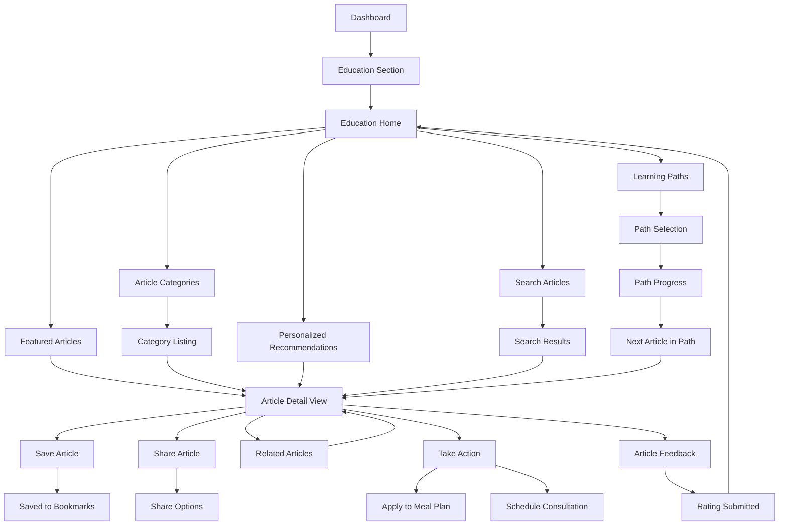

# Nutrition Education User Flow

This document outlines the step-by-step flow for the nutrition education feature of the NutriGenius application.

## Flow Diagram

## Detailed Steps

### 1. Accessing Education Content

**1.1 Dashboard Navigation**
- **Screen Elements**:
  - Dashboard with Education section card
  - Recommended article preview
  - Education progress indicator
- **User Actions**: Tap on Education section card

**1.2 Education Home**
- **Screen Elements**:
  - Featured articles carousel
  - Category browsing section
  - Personalized recommendations section
  - Search bar
  - Learning paths section
  - Recently viewed articles
- **User Actions**: Choose content access method (featured, categories, recommendations, search, or learning paths)

### 2. Content Discovery Methods

**2.1 Featured Articles**
- **Screen Elements**:
  - Horizontally scrollable carousel
  - Article cards with:
    - Featured image
    - Title
    - Brief description
    - Estimated reading time
    - Category tag
  - "See All" option
- **User Actions**: 
  - Scroll through featured articles
  - Tap article to read
  - Tap "See All" for more featured content

**2.2 Article Categories**
- **Screen Elements**:
  - Grid or list of categories:
    - Nutrition Basics
    - Age-Specific Nutrition
    - Stunting Prevention
    - Healthy Recipes
    - Feeding Challenges
    - Dietary Restrictions
    - Growth & Development
  - Category icon and name
  - Article count per category
- **User Actions**: Tap category to view articles within it

**2.2.1 Category Listing**
- **Screen Elements**:
  - Category name and description
  - Filtering options (age range, topic, etc.)
  - Sorting options (newest, most popular, etc.)
  - List of articles in category
  - Back to categories button
- **User Actions**:
  - Apply filters/sorting
  - Tap article to read
  - Return to categories

**2.3 Personalized Recommendations**
- **Screen Elements**:
  - "Recommended for You" section
  - Articles tailored to:
    - Child's age and development stage
    - Recent growth measurements
    - Dietary preferences/restrictions
    - Previous reading history
  - Reason for recommendation label
- **User Actions**: Tap recommended article to read

**2.4 Search Articles**
- **Screen Elements**:
  - Search bar with placeholder text
  - Recent searches (if applicable)
  - Search suggestions as user types
  - Voice search option
- **User Actions**: 
  - Enter search term
  - Select from suggestions
  - Use voice search
  - Submit search

**2.4.1 Search Results**
- **Screen Elements**:
  - Search term display
  - Result count
  - Filter options
  - Sorted list of matching articles
  - Highlighted matching terms
  - "No results" view with suggestions (if applicable)
- **User Actions**:
  - Refine search if needed
  - Apply filters
  - Tap article to read

**2.5 Learning Paths**
- **Screen Elements**:
  - List of available learning paths:
    - Stunting Prevention Essentials
    - First 1000 Days Nutrition
    - Introducing Solid Foods
    - Picky Eater Solutions
    - Nutrient Deficiency Prevention
  - Path description and article count
  - Completion status for started paths
- **User Actions**: Select learning path

**2.5.1 Path Selection**
- **Screen Elements**:
  - Path title and description
  - Estimated completion time
  - List of articles/modules in sequence
  - Progress indicator for started paths
  - "Begin Path" or "Continue Path" button
- **User Actions**: Begin or continue learning path

**2.5.2 Path Progress**
- **Screen Elements**:
  - Progress visualization (e.g., progress bar)
  - Completed articles with checkmarks
  - Current article highlighted
  - Locked/upcoming articles
  - Path completion rewards/badges
- **User Actions**: 
  - View progress
  - Tap next article in sequence
  - Review completed articles

### 3. Article Reading Experience

**3.1 Article Detail View**
- **Screen Elements**:
  - Article title
  - Author and publication date
  - Featured image
  - Estimated reading time
  - Category tags
  - Share and bookmark buttons
  - Article content with proper typography
  - Progress indicator
  - Table of contents (for longer articles)
- **User Actions**:
  - Read article
  - Scroll through content
  - Use table of contents to navigate
  - Tap images to enlarge

**3.2 Content Interaction**
- **Screen Elements**:
  - Interactive elements within articles:
    - Expandable sections
    - Definition tooltips
    - Embedded videos or animations
    - Interactive infographics
    - Calculators or tools
  - Highlight and note-taking functionality
- **User Actions**:
  - Interact with embedded elements
  - Highlight important information
  - Take notes

**3.3 Article Actions**
- **Screen Elements**:
  - Bookmark button
  - Share button
  - Related articles section
  - "Take Action" button
  - Feedback/rating section
- **User Actions**: Use available actions as needed

**3.3.1 Save Article**
- **Screen Elements**:
  - Bookmark icon that changes state when tapped
  - Confirmation message
  - Optional collection/folder selection
- **User Actions**: 
  - Tap bookmark icon
  - Select collection (if applicable)

**3.3.2 Share Article**
- **Screen Elements**:
  - Share sheet with options:
    - Social media
    - Messaging
    - Email
    - Copy link
    - Print
  - Preview of shared content
- **User Actions**: Select sharing method and recipients

**3.3.3 Related Articles**
- **Screen Elements**:
  - "Related Articles" section at end of article
  - 3-5 related article cards
  - "More Like This" button
- **User Actions**: Tap related article to read next

**3.3.4 Take Action**
- **Screen Elements**:
  - Action buttons relevant to article content:
    - "Apply to Meal Plan"
    - "Try This Recipe"
    - "Schedule Consultation"
    - "Track Measurement"
    - "Set Reminder"
  - Brief explanation of action benefit
- **User Actions**: Select appropriate action

**3.4 Article Feedback**
- **Screen Elements**:
  - "Was this helpful?" prompt
  - Star rating system
  - Optional comment field
  - "Submit Feedback" button
- **User Actions**:
  - Provide rating
  - Add optional comment
  - Submit feedback

### 4. Saved Content & History

**4.1 Bookmarks View**
- **Screen Elements**:
  - List of saved articles
  - Collection/folder organization
  - Search and filter options
  - Reading progress indicators
  - Remove bookmark option
- **User Actions**:
  - Browse saved articles
  - Organize collections
  - Remove bookmarks
  - Continue reading

**4.2 Reading History**
- **Screen Elements**:
  - Chronological list of read articles
  - Reading completion percentage
  - "Continue Reading" for partially read articles
  - Clear history option
- **User Actions**:
  - Browse history
  - Continue reading
  - Clear history items

## Special Cases

### Offline Reading
- **Functionality**:
  - Automatic caching of opened articles
  - Manual article downloading for offline access
  - Offline indicator when viewing cached content
  - Sync reading progress when back online

### Age-Specific Content Filtering
- **Implementation**:
  - Automatic filtering based on child's age
  - Clear indication of age-appropriateness
  - Option to view content for different age ranges
  - Warning when accessing content not matching child's age

### Content Translation
- **Features**:
  - Language selection option
  - Automatic translation of content
  - Original language toggle
  - Language preference saving

### Accessibility Features
- **Accommodations**:
  - Text-to-speech reading
  - Font size adjustment
  - High contrast mode
  - Screen reader optimization
  - Alternative text for images

## Success Metrics

- **Content Engagement**: Average time spent reading articles
- **Completion Rate**: Percentage of started articles that are read to completion
- **Sharing Activity**: Frequency of article sharing
- **Bookmarking Rate**: Percentage of read articles that are bookmarked
- **Learning Path Completion**: Percentage of started paths that are completed
- **Action Conversion**: Rate of taking recommended actions from articles
- **Search Effectiveness**: Search success rate and refinement frequency

## Integration Points

- **Growth Monitoring**: Contextual article recommendations based on growth data
- **Food Scanning**: Educational content linked from scanned food items
- **Meal Planning**: Recipe articles that can be added directly to meal plans
- **Consultation**: Direct scheduling from relevant health concern articles
- **Notifications**: Content discovery reminders and new article alerts 