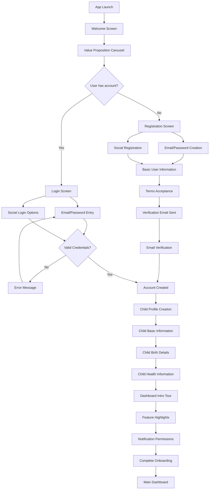

# User Onboarding Flow

This document outlines the step-by-step flow for new users during the onboarding process of the NutriGenius application.

## Flow Diagram

## Detailed Steps

### 1. App Launch & Introduction

**1.1 Welcome Screen**
- **Screen Elements**:
  - NutriGenius logo (large)
  - Tagline: "Smart nutrition for growing children"
  - Background: Gradient with soft imagery related to healthy children
- **User Actions**: Tap "Get Started" button

**1.2 Value Proposition Carousel**
- **Screen Elements**:
  - 3-4 slides highlighting key features:
    1. Growth tracking with WHO standards
    2. Food scanning and nutritional analysis
    3. Personalized education content
    4. Expert consultation access
  - Progress dots to indicate current slide
  - "Skip" option in top right
- **User Actions**: Swipe through slides or tap "Skip"

### 2. Authentication

**2.1 Authentication Choice**
- **Screen Elements**:
  - "Sign In" and "Create Account" options
  - Brief explanation of account benefits
- **User Actions**: Choose to sign in or create account

**2.2A Login Flow (Existing Users)**
- **Screen Elements**:
  - Email field
  - Password field
  - "Forgot Password" link
  - Social login options (Google, Facebook)
  - "Remember me" checkbox
- **User Actions**: 
  - Enter credentials and tap "Sign In" 
  - OR select social login option

**2.2B Registration Flow (New Users)**
- **Screen Elements**:
  - Email field
  - Password field (with strength indicator)
  - Confirm password field
  - Social registration options (Google, Facebook)
- **User Actions**: 
  - Enter new credentials and tap "Continue" 
  - OR select social registration option

**2.3 Basic User Information**
- **Screen Elements**:
  - Full name field
  - Phone number field (optional)
  - Role selection (Parent, Caregiver, Healthcare provider)
- **User Actions**: Complete fields and tap "Continue"

**2.4 Terms and Privacy Acceptance**
- **Screen Elements**:
  - Summary of key terms and privacy points
  - Links to full Terms of Service and Privacy Policy
  - Checkbox to accept
- **User Actions**: Review, check acceptance box, tap "Continue"

**2.5 Email Verification**
- **Screen Elements**:
  - Confirmation message that verification email was sent
  - Email address display with edit option
  - "Resend Email" option
  - Instructions to check spam folder
- **User Actions**: 
  - Open email client and verify email
  - Return to app manually or via deep link in email

### 3. Child Profile Setup

**3.1 Child Profile Introduction**
- **Screen Elements**:
  - Explanation of why child profile is important
  - Benefits of accurate information
  - Privacy assurance message
- **User Actions**: Tap "Add Child" button

**3.2 Child Basic Information**
- **Screen Elements**:
  - Child's name field
  - Gender selection
  - Photo upload option (optional)
- **User Actions**: Complete fields and tap "Continue"

**3.3 Child Birth Details**
- **Screen Elements**:
  - Date of birth picker
  - Birth weight field (with unit selection)
  - Birth height field (with unit selection)
  - Premature birth checkbox (reveals gestational age if checked)
- **User Actions**: Complete fields and tap "Continue"

**3.4 Child Health Information**
- **Screen Elements**:
  - Known allergies/restrictions checklist
  - Medical conditions checklist (optional)
  - Additional notes field (optional)
- **User Actions**: Complete fields and tap "Finish"

### 4. App Introduction

**4.1 Dashboard Introduction**
- **Screen Elements**:
  - Overlay highlights on key dashboard elements
  - Brief explanation of dashboard metrics
  - "Next" button
- **User Actions**: Tap "Next" to proceed through tour

**4.2 Feature Highlights**
- **Screen Elements**:
  - Guided tour of main navigation:
    1. Growth tracking feature
    2. Food scanning feature
    3. Educational content section
    4. Consultation booking
  - "Next" button on each highlight
- **User Actions**: Tap "Next" to proceed through highlights

**4.3 Notification Setup**
- **Screen Elements**:
  - Explanation of notification types:
    - Measurement reminders
    - Educational content updates
    - Consultation reminders
    - Growth milestones
  - Toggle switches for each notification type
- **User Actions**: Set notification preferences and tap "Continue"

**4.4 Onboarding Completion**
- **Screen Elements**:
  - Success message
  - Summary of completed setup
  - "Suggested next steps" list
  - Confetti animation effect
- **User Actions**: Tap "Go to Dashboard"

## Success Metrics

- **Completion Rate**: Percentage of users who complete the entire onboarding flow
- **Time to Complete**: Average time taken to complete onboarding
- **Drop-off Points**: Screens where users commonly abandon the process
- **Child Profile Completion**: Percentage of users who complete child profile creation
- **Verification Rate**: Percentage of users who verify their email

## Friction Reduction Strategies

1. **Progress Indicator**: Clear indicator of steps completed and remaining
2. **Field Validation**: Real-time validation with helpful error messages
3. **Optional Fields**: Clearly marked optional fields to reduce required input
4. **Save and Continue Later**: Option to pause onboarding and continue later
5. **Help Access**: Easy access to help resources throughout the flow
6. **Simplified Social Auth**: One-tap social authentication where possible

## Special Cases

### Multiple Children
- After completing the first child profile, users are asked if they want to add another child
- "Add Another Child" button takes them back to Child Basic Information screen
- "Continue to Dashboard" option if they don't want to add more children

### Returning Unverified Users
- If a user returns before verifying email, show reminder screen
- Provide option to resend verification email
- Allow temporary access with limitations clearly indicated

### Interrupted Onboarding
- Save progress automatically at each step
- When user returns, offer to continue from last completed step
- Provide option to restart onboarding if desired 